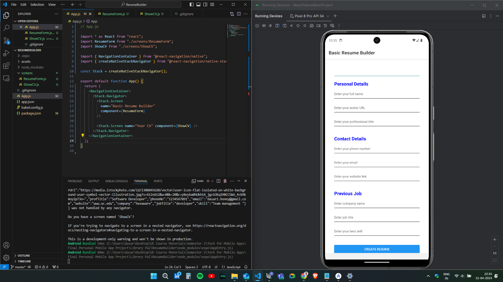
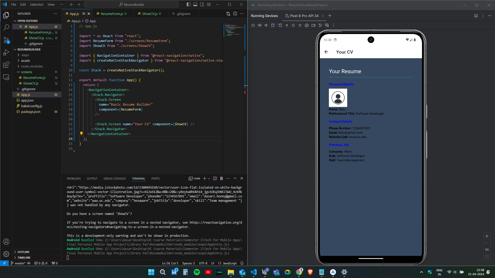

# Tech For Mobile Applications

## Instructor: William Agangiba

# Personal Mobile Application Final Project

# Team members

1. Satya Nageswara Anirudh Dasari, dasarisu@mail.uc.edu
2. Divya Goud Inteniki, intenidd@mail.uc.edu
3. Balakrishna Jurollu, jurollba@mail.ec.edu

# Project Repository
Source code repository (private access): <https://github.com/Anirudh-Dasari/Personal-Mobile-App-Project-Final>

# Overview
As a Team, we have developed an application called Resume Builder. In this resume builder, one can be able to input their personal details which are needed to be added for their resume and create a very basic template. For this application we have used react native framework, used some concepts called react states and hooks. The project structure includes a folder called screens, where we have developed two screens namely, ResumeForm.js and ShowCV.js where in the ResumeForm.js, the user will be seeing some input fields to enter his/her data which needs to be added to the react states which are then be able to view in the final template. Once the user enters all the details in the ResumeForm page, then the user clicks on the create resume button. Once the user clicks on it, the user will be redirected to a new page, which is ShowCV, where this is the output rewsume template which has all the user data given in the ResumeForm. The demonstration of this application is showcased in the video which is present in the project repository along with the screenshots which are inserted in the below sections of this document. 

The Demonstration Video link: <https://github.com/Anirudh-Dasari/Personal-Mobile-App-Project-Final> 
# Screenshots
Screenshots:
The user when opens the application, he/she can be able to see the input fields for adding their personal information for generating the resume. The below screenshot showcased the page which is developed by our team.
 

Once the user clicks on the create resume button in the first page, the user will be able to see a new page which contains the information that is given by the user in a basic template, which is showcased in the below screenshot.
 

# Completed Tasks: 

1. Created a new React Native Project with the name of Resume Builder.
2. Installed few required dependencies, namely @react-navigation/native, @react-navigation/native-stack, react-native-safe-area-context, react-native-screens, react-native-vector-icons.
3. Created Two screens namely, ResumeForm.js and ShowCV.js files in the project directory.
4. Modified the App.js file.
5. Run the Application in the Android Studio Emulator.

# Contributions: 
2.	Satya Nageswara Anirudh Dasari,  2 hours, ResumeForm.js.
3.	Divya Goud Inteniki, 2  hours, ShowCV.js.
4.	Balakrishna Jurollu, 2 hours, App.js.


# Appendix
App.js:

```javascript
import * as React from "react";
import ResumeForm from "./screens/ResumeForm";
import ShowCV from "./screens/ShowCV";

import { NavigationContainer } from "@react-navigation/native";
import { createNativeStackNavigator } from "@react-navigation/native-stack";

const Stack = createNativeStackNavigator();

export default function App() {
	return (
		<NavigationContainer>
			<Stack.Navigator>
				<Stack.Screen
					name="Basic Resume Builder"
					component={ResumeForm}
				/>

				<Stack.Screen name="Your CV" component={ShowCV} />
			</Stack.Navigator>
		</NavigationContainer>
	);
}


